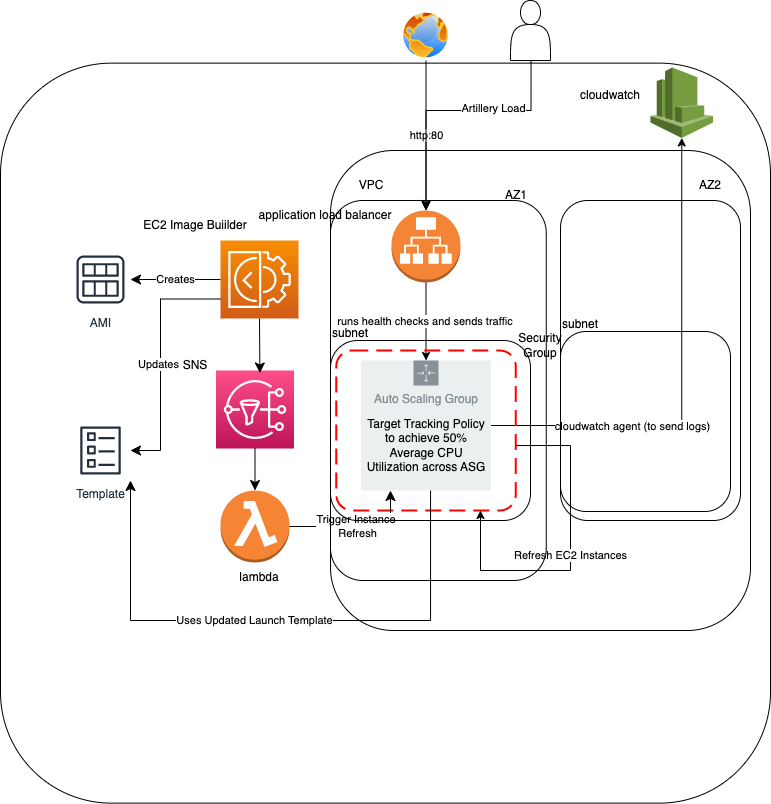

# lifebit-tech-challenge
This repo aims to provide solutions to the lifebit technical challenge.

## Overall Architecture (basic and optional requirements)


## Global Requirements
### AWS Free Tier

## Basic Requirements

### 1. Application must be on the internet and access on port 80
### 2. The solution should be fault tolerance and high availability
#### AWS services used:

- Auto Scaling Group (Compute)
- Application Load Balancer (Traffic Forwarding, Health Checks)
- VPC, Public Subnet, ACL, Route Table, Internet Gateway (Networking)

##### Description:
Please refer to **network.tf**, **compute.tf** and **alb.tf** for this requirement.
**network.tf**
```sh
module "vpc" {
  source = "terraform-aws-modules/vpc/aws"
  azs             = ["ap-southeast-1a", "ap-southeast-1b"]
  public_subnets  = ["10.0.101.0/24", "10.0.102.0/24"]
```
**compute.tf**
```sh
module "asg" {
  source  = "terraform-aws-modules/autoscaling/aws"
  min_size                  = 2
  max_size                  = 5
  desired_capacity          = 2
  wait_for_capacity_timeout = 0
  health_check_type         = "EC2"
  vpc_zone_identifier       = [module.vpc.public_subnets[0],module.vpc.public_subnets[1]]
  target_group_arns         = [module.alb.target_group_arns]
```

**alb.tf**
```sh
module "alb" {
  source  = "terraform-aws-modules/alb/aws"
  name = "my-alb"
  load_balancer_type = "application"
  vpc_id             = module.vpc.vpc_id
  subnets            = [module.vpc.public_subnets[0], module.vpc.public_subnets[1]]
  target_groups = [
    {
      name_prefix      = "pref-"
      backend_protocol = "HTTP"
      backend_port     = 80
      target_type      = "instance"
```
###### Explanation
By using an auto scaling group, with a min size and desired capacity of 2, we ensure that there will always be 1 instance of the application serving the endpoint even if 1 instance goes down, achieving **higher availability**. 
We also allow for the instances to be deployed across 2 subnets in 2 availability zones, hence achieving higher **fault tolerance**.
To achieve load balancing requests between the instances, we also use an application load balancer to do health checks on the endpoints. Auto Scaling Group will auto-add the list of instances to the target group, and ALB will serve traffic equally, if not will serve to the ready instance over port 80.

### 3.Implement code to scale the number of replicas of the service based on the usage of the resources. Scale-up when service is needs more resources, scale-down when they are not required.
### 4. Implement code to simulate load (useful for testing the previous goal)
#### AWS services used:
- Auto Scaling Group (Compute)
- Fault Injection Simulator (but not available in free tier so we use local computer with artemis instead)

##### Description: 
Please refer to **compute.tf** and **load-test** folder for this requirement.
**compute.tf**
```sh
module "asg" {
  source  = "terraform-aws-modules/autoscaling/aws"
  scaling_policies = {
    my-policy = {
      policy_type               = "TargetTrackingScaling"
      target_tracking_configuration = {
        predefined_metric_specification = {
          predefined_metric_type = "ASGAverageCPUUtilization"
          resource_label         = "MyLabel"
        }
        target_value = 50.0
      }
    }
```
**load-test/package.json**
```sh
{
    "name": "load-test",
    "scripts": {
        "load-test": "artillery run .stress.yml"
    },
    "dependencies": {
        "artillery": "^2.0.0"
    }
}
```
**load-test/stress.yml**
```sh
config:
  target: "http://<<ALB-IP>>:80"
  phases:
    - duration: 10
      arrivalRate: 1
      maxVusers: 10
```
###### Explanation
By using a autoscaling policy of type *TargetTrackingScaling*, we let AWS auto balance the traffic vs application instances so that it will achieve our target CPU average utilization percentage of 50% across the ASG. We could also set an upper limit on CPU usage and lower limit on CPU usage before scale up and down as another option. 
To produce stress test on the application, I have chosen artillery package from npm. It is easy to configure and run from the local computer in this case. I have yet to explore Fault Injection Simulator, but believe it may also be able to handle this task.

### 5.The solution should be easy to manage/maintain, if this is not possible to achieve then describe futures changes to get
#### Folder Structure used:
- backend - used for containing backend configuration for other environments, i.e. staging, prod
- load test - for load test
- var - used for containing variables specific for other environments
- locals - used for containing variables that is common to all environments 
- compute/alb/network - separating by component type so that is easier when doing a search. 
- variables - used to abstract configurations we want to change across environments
- outputs - used to expose variables to other tf stacks

###### Explanation
We have used public modules from **terraform-aws-modules** in this project heavily. I believe in *DRY* code, hence we should not repeat code unless the previous code does not fit the current requirements. 
This folder structure and file separation are what I believe to be a good way to structure this repo for this task for **maintainability** and easy **management**, as well as to extend this application to be run on other environments. The variables file has yet to be filled out as it is dependent on the team which variables should change between environments.

## Optional Requirements
### 1. Application is deployed when provision is happening
#### AWS services used:

- Auto Scaling Group (Compute)
- Amazon Machine Images (To bake application into)

##### Description: 
Please refer to **compute.tf** and **packer/ami-test.json** for this requirement.
**compute.tf**
```sh
module "asg" {
  source  = "terraform-aws-modules/autoscaling/aws"

  # Autoscaling group
  name = "example-asg"
  user_data                 = //This should be used to run  
  //user_data                 = //This should be used to run  
  //1. start the application - cd servers/express/api-with-express-and-handlebars && npm start 
  //2. start cloudwatch agent to collect logs - sudo /opt/aws/amazon-cloudwatch-agent/bin/amazon-cloudwatch-agent-ctl -a fetch-config -m ec2 -s -c file:configuration-file-path
  image_id          = var.ami_image
```
**packer/ami-test.json**
```sh
{
    "variables": {
      "aws_access_key": "",
      "aws_secret_key": ""
    },
    "builders": [{
      "type": "amazon-ebs",
      "access_key": "{{user `aws_access_key`}}",
      "secret_key": "{{user `aws_secret_key`}}",
      "region": "ap-south-1",
      "source_ami": "ami-06a0b4e3b7eb7a300",
      "skip_region_validation":"true",
      "instance_type": "t2.micro",
      "ssh_username": "ec2-user",       
      "ami_name": "express-node-js"
    }],
    "provisioners": [{
      "type": "shell",
      "inline": [
        "sleep 30",
        //installs cloudwatch agent
        "sudo yum install amazon-cloudwatch-agent",
        //installs nodejs repo
        "git clone git@github.com:nodejs/examples.git"
      ]
    }]
  }
```

###### Explanation
To make sure application is deployed when provision is happening, we should 
- Use a tool Packer to bake an image with the application installed
- Then use instance user data to start the application

### 2. The solution can be up and running by executing a single command/script
##### Description: 
**makefile**
```sh
load-test:
	cd load-test && npm i && npm run load-test

build-app:
	packer build packer/ami-test.json > //get ami-image somehow as output
	terraform init
	terraform apply --auto-approve --var ami_image=<ami-image>
```
###### Explanation
We use makefile to achieve this. By running build-app and load test, we will apply all terraform resources in this repo, and the load test respectively.

### 3. Management access (SSH or RDP) to the servers are allowed only for restricted IPs
#### AWS services used:
- Security Group (vm firewall)

##### Description: 
Please refer to **sg.tf** for this requirement.
**sg.tf**
```sh
module "sg" {
  source = "cloudposse/security-group/aws"
  attributes = ["primary"]

  allow_all_egress = true

  rules = [
    {
      key         = "ssh"
      type        = "ingress"
      from_port   = 22
      to_port     = 22
      protocol    = "tcp"
      cidr_blocks = ["client_IP"]
      self        = null  # preferable to self = false
      description = "Allow SSH from somewhere"
    },
    {
      key         = "rdp"
      type        = "ingress"
      from_port   = 3389
      to_port     = 3389
      protocol    = "tcp"
      cidr_blocks = ["client_IP"]
      self        = null  # preferable to self = false
      description = "Allow RDP from somewhere"
    },
    {
      key         = "HTTP"
      type        = "ingress"
      from_port   = 80
      to_port     = 80
      protocol    = "tcp"
      cidr_blocks = []
      self        = true
      description = "Allow HTTP from inside the security group"
    }
  ]

  vpc_id  = module.vpc.vpc_id

}
```
###### Explanation
We use security group to restrict ssh and rdp access to the VM.

### 4. Application logs are centralised on a different service
#### AWS services used:
- Auto Scaling Group (Compute)
- Cloudwatch Logs (For log viewing)
##### Description: 
Please refer to **compute.tf** for this requirement.
**compute.tf**
```sh
module "asg" {
  source  = "terraform-aws-modules/autoscaling/aws"

  # Autoscaling group
  name = "example-asg"
  user_data                 = //This should be used to run  
  //1. start the application - npm start 
  //2. start cloudwatch agent - sudo /opt/aws/amazon-cloudwatch-agent/bin/amazon-cloudwatch-agent-ctl -a fetch-config -m ec2 -s -c file:configuration-file-path
  image_id          = // image that we baked with nodejs, application contained and cloudwatch agent installed
  iam_role_policies = {
    AmazonSSMManagedInstanceCore = "arn:aws:iam::aws:policy/AmazonSSMManagedInstanceCore",
    CloudWatchAgentServerPolicy = "arn:aws:iam::aws:policy/CloudWatchAgentServerPolicy"
  }
```
###### Explanation
Similar to optional item 1, we assume that cloudwatch agent has been installed and configuration file has been configured in AMI. By attaching the CloudWatchAgentServerPolicy iam role policy, each instance will be able to send the logs to cloudwatch logs to be centralised.

### 5. Design and implement a process for deploying new application versions with no downtime
#### AWS services used:
- Auto Scaling Group (Compute)
- Amazon Machine Images (To bake application into)
- EC2 image builder (To build AMI)
- SNS (To send notificaiton from image builder to lambda)
- Lambda (to trigger instance refresh on ASG)

##### Description: 
Please refer to **compute.tf** for this requirement.
**compute.tf**
```sh
module "asg" {
  source  = "terraform-aws-modules/autoscaling/aws"
  instance_refresh = {
    strategy = "Rolling"
    preferences = {
      checkpoint_delay       = 600
      checkpoint_percentages = [35, 70, 100]
      instance_warmup        = 300
      min_healthy_percentage = 50
    }
    triggers = ["tag"]
  }
```

###### Explanation
The following block will allowing for rolling upgrade in ASG. Please refer to architecture diagram for implementation.
- EC2 image builder builds image, sends notification to SNS and updates launch template
- SNS forwards message via subscription to lambda
- Lambda triggers instance refresh on ASG, upgrading the instances in rolling update style.

## Improvements that can be made
- Shift packer step to EC2 image builder fully, even when building the image
- Create CICD pipeline so that same template can be run on different environments
- parameterize more values that may be different across environments in all scripts